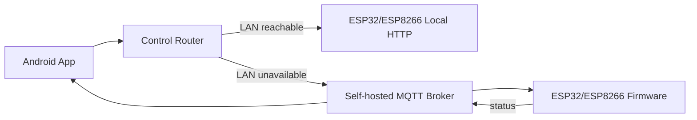

# Premium IoT Platform Architecture

This repository contains a production-oriented, cost-free starter platform for ESP32 and ESP8266 IoT projects.

## Runtime Flow



## Device Template Contract

```json
{
  "device_id": "living-light-01",
  "device_name": "Living Light",
  "device_type": "smart_light",
  "room": "Living Room",
  "local_host": "192.168.1.91",
  "controls": [
    {"type": "toggle", "topic": "/power", "label": "Power"},
    {"type": "slider", "topic": "/intensity", "label": "Brightness", "min": 1, "max": 100, "step": 1, "unit": "%"},
    {"type": "scheduler", "topic": "/schedule", "label": "Schedule"}
  ]
}
```

Supported controls:

- `toggle`
- `slider`
- `button`
- `value`
- `scheduler`

## Security Notes

- LAN-only demos can use plain HTTP/MQTT on trusted WiFi.
- For remote control, prefer VPN access to your home MQTT broker.
- If exposing MQTT directly, use TLS and username/password.
- Do not commit real WiFi credentials.
